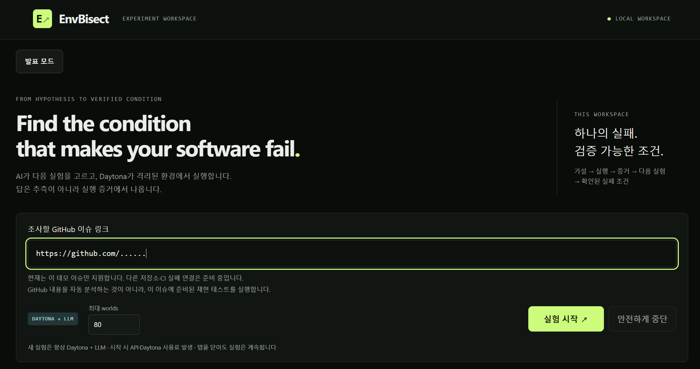

# EnvBisect

### Find the condition that makes your software fail.

**실행 조건을 하나씩 바꾸며 실제 코드를 반복 실행해, 실패가 재현되는 조건과 통과로 바뀌는 조건을 찾는 디버깅 도구입니다.**



## AI가 원인을 말해도, 아직 결정할 수 없는 것

어제까지 통과하던 CI 작업이 런타임 업데이트 직후 실패했다고 가정해 보겠습니다.
코드는 그대로이고, AI는 로그를 보고 “런타임 회귀로 보인다”는 그럴듯한 설명을 제시합니다.

하지만 개발자가 실제로 알아야 하는 것은 더 구체적입니다.

**새 런타임 전체에서 실패할까요, 특정 옵션이나 입력에서만 실패할까요? 무엇을 바꾸면 실제로 다시 통과할까요?**

이 질문에 답하려면 이전 환경과 실패 환경을 다시 만들고, 다른 조건은 고정한 채 한 조건씩 바꾸며 코드를 실행해야 합니다.
EnvBisect는 AI의 가설과 엔지니어의 결정 사이에 남아 있는 이 실험 과정을 자동화합니다.

> A hypothesis tells you what might be wrong.  
> An experiment shows which conditions actually matter.

## 한 번의 설명이 아니라, 증거가 이어지는 실험 루프

EnvBisect는 알려진 정상 조건과 실패 조건을 다시 실행하는 것부터 시작합니다.
그 결과를 읽은 LLM이 다음에 비교할 조건을 고르면, 엔진이 선택을 검사하고 Daytona가 조건별 독립 환경에서 코드를 실행합니다.

여기서 **world**는 런타임·입력·옵션이 하나의 조합으로 고정된 새 Daytona sandbox입니다.
각 world는 다른 실험의 상태에 영향을 받지 않으며, 실행과 증거 수집이 끝나면 삭제됩니다.

```text
알려진 정상·실패 조건을 새 환경에서 재현
        ↓
LLM이 허용된 조건 중 다음 비교를 선택
        ↓
엔진이 한 번에 한 조건만 달라지는지 검사
        ↓
Daytona가 독립된 world들을 병렬 실행
        ↓
실제 PASS·FAIL 결과가 다음 실험을 결정 ↺
        ↓
실패 조건·통과 조건·재현 가능한 실행 기록
```

LLM은 무엇을 시험할지 제안합니다.
엔진은 실험 범위와 검증 규칙을 지키고, **PASS와 FAIL은 모델의 확신이 아니라 실제 실행이 결정합니다.**

## 데모에서 실제로 조사하는 문제

현재 데모는 [Node.js #65601](https://github.com/nodejs/node/issues/65601)을 위해 준비한 재현 테스트를 실행합니다.
같은 8-byte pooled buffer에서 `Uint32Array`를 만드는 작업이 Node 26.7.0에서는 통과하지만 Node 26.8.1에서는 `RangeError`로 실패하는 상태가 출발점입니다.

EnvBisect는 먼저 이 정상·실패 기준선을 서로 다른 world에서 재현합니다.
그다음 실패 런타임은 유지하고, 매 실험에서 한 조건만 바꿉니다.

- **길이를 명시하면 통과하는가?** 암시적 길이 계산이 결과에 영향을 주는지 확인합니다.
- **할당 방식이나 배열 너비를 바꾸면 통과하는가?** 실패와 관련된 조건을 서로 분리합니다.
- **입력 크기만 바꾸면 어디서 결과가 달라지는가?** 실제 실행값으로 FAIL과 PASS 사이의 구간을 좁힙니다.

LLM이 숫자 축을 선택하면 후보 생성과 반복 확인은 결정론적 엔진이 담당합니다.
발표 모드에서는 실제 실행 기록을 **문제 → 기준선 재현 → 통제된 비교 → 증거에 따른 다음 선택 → 경계 탐색 → 증거 패키지** 순서로 보여줍니다.

핵심은 많은 테스트를 실행했다는 사실이 아닙니다.
**방금 얻은 증거가 다음에 무엇을 실행할지 바꾼다는 점입니다.**

## 개발자가 받는 결과: Evidence Package

EnvBisect는 “아마 이것 때문”이라는 설명 대신, 다음 판단에 필요한 실행 기록을 남깁니다.

| 개발자의 질문 | Evidence Package에 남는 내용 |
|---|---|
| 어떤 조건에서 실패했나? | 런타임·입력·옵션과 실제 FAIL 관찰 |
| 무엇을 바꾸면 통과했나? | 바꾼 조건 하나와 그대로 유지한 조건, 실제 PASS 관찰 |
| 결과를 다시 확인할 수 있나? | 실행 명령·원시 관찰·반복 확인·실행 환경의 출처 |
| 다른 사람에게 무엇을 넘기나? | 다운로드 가능한 실험 이력·재현 코드·환경 준비 정보 |

검증에 성공하면 결과는 **verified failure condition**으로 저장됩니다.
쉽게 말해, “이 고정 조건에서는 여기까지 FAIL이고 이 조건부터 PASS였다”는 관찰된 실행 경계입니다.

이 결과는 root cause나 애플리케이션 전체의 수정 완료를 뜻하지 않습니다.
수정 후보나 우회 방법을 검토하고, 다른 개발자 또는 coding agent가 같은 조건을 다시 실행할 수 있게 하는 증거입니다.

### 결론을 만들 수 없을 때도 숨기지 않습니다

실제 시스템의 결과가 항상 깔끔하게 나뉘는 것은 아닙니다.
PASS 이후 다시 FAIL이 관찰되거나 실행 예산 안에 경계를 확인하지 못하면 EnvBisect는 결론을 추측하지 않고 **INCONCLUSIVE**로 종료합니다.

- `VERIFIED_FAILURE_CONDITION`: 고정된 조건에서 FAIL/PASS 경계를 새 실행으로 반복 확인했습니다.
- `INCONCLUSIVE`: 관찰이 비단조적이거나 실행 예산 안에 검증을 끝내지 못했습니다.
- `CANCELLED` / `ERROR`: 사용자가 중단했거나 실행 오류가 발생했습니다. 생성된 Daytona world의 정리 상태를 기록에서 확인할 수 있습니다.

## 왜 Daytona인가?

LLM이 다음 실험을 고를 때마다 그 조건을 실제로 실행할 깨끗한 환경이 필요합니다.
대화 안에서 명령만 반복하면 이전 실행의 상태가 섞일 수 있고, 여러 환경의 생성·병렬 실행·정리와 로그 추적을 모두 모델의 문맥으로 관리해야 합니다.

Daytona는 EnvBisect에서 **하나의 조건 조합을 하나의 독립된 실행 환경으로 바꾸는 역할**을 합니다.
EnvBisect는 API로 world를 생성하고, 비교 실험을 병렬 실행하고, 증거를 수집한 뒤 world를 삭제합니다.
화면과 Evidence Package에는 생성·실행·증거 수집·정리 이력이 함께 남습니다.

CI도 동적 매트릭스를 만들 수 있고 coding agent도 실험을 실행할 수 있습니다.
EnvBisect는 이 기능들을 **증거에 따른 다음 실험 선택, 한 조건만 바꾸는 비교, 반복 검증, 실행 이력 보존**이라는 하나의 조사 흐름으로 묶습니다.

> The LLM chooses the experiment.  
> Daytona creates the worlds.  
> Execution decides what's true.

## 직접 실행해 보기

로컬 웹을 열면 Node.js #65601 링크가 미리 입력되어 있습니다.
**실험 시작**을 누르면 OpenAI planner와 Daytona를 사용하는 새 유료 실행이 시작됩니다.
기본 설정에서는 최대 80개의 world를 허용하며, 실행 수는 실제 조사 결과와 설정한 예산에 따라 달라집니다.

이전 기록을 열거나 발표 모드로 보는 작업은 새 실험을 시작하지 않습니다.
브라우저 탭을 닫아도 진행 중인 실행은 멈추지 않으므로, 중단할 때는 화면의 **안전하게 중단**을 누르고 world 정리가 끝날 때까지 서버를 유지해야 합니다.

현재 웹 데모가 새 조사로 지원하는 입력은 준비된 Node.js 이슈 하나입니다.
임의의 GitHub 이슈·PR·CI 링크를 자동으로 분석해 재현 테스트를 만드는 기능은 아직 구현되지 않았습니다.

필요한 키, 설치 과정, 실행 명령은 [실행 가이드](docs/DEVELOPMENT.md#quick-start--windows-cmd)에 정리되어 있습니다.
실제 검증 범위와 완료·미완료 기록은 [검증 기록](VERIFICATION.md)에서 확인할 수 있습니다.
