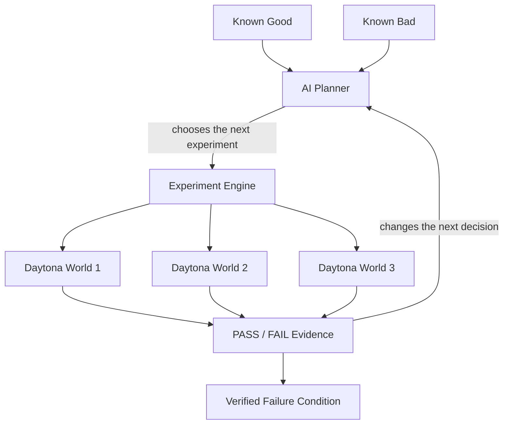
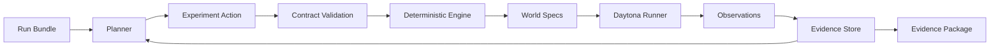

<!--
Draft for the public GitHub repository.
Before publishing, reconcile commands, screenshots, counts, and implementation status
against the final repository and its latest live run.
-->

# EnvBisect

### Find the condition that makes your software fail.

**CI tells you that something failed.  
AI can tell you what might be wrong.  
EnvBisect runs the experiments that show under which conditions it actually fails.**

Built for the Daytona HackSprint.

<!-- Replace with the final Experiment Workspace screenshot or short demo GIF. -->

---

## The debugging gap

Imagine a dependency or runtime update breaks a CI job.

You paste the logs into an AI coding agent and get a reasonable answer:

> “This looks like a runtime regression.”

Useful—but not enough to make an engineering decision.

Does every workload fail on that runtime? Does the failure disappear with a different option? Is it triggered only by a particular input? Should you roll back the runtime, use a workaround, or wait for an upstream fix?

**Someone still has to prove it.**

```text
recreate an environment
        ↓
change one condition
        ↓
run the test
        ↓
compare the result
        ↓
form the next hypothesis
        ↓
repeat
```

That last mile between an AI hypothesis and executable evidence is the problem EnvBisect is built to solve.

**EnvBisect turns that sequence into a repeatable experimental debugging loop.**

> The missing layer is not another explanation.  
> It is the experiment loop between a hypothesis and evidence.

---

## This is a real debugging problem

**The expensive part is often not getting a hypothesis. It is proving which conditions actually matter.**

Reproduction and execution context are not just conveniences.

- In [Google's agentic bug-reproduction study](https://arxiv.org/html/2502.01821v2#S6.SS2), plausible fixes on a 23-bug reproduction-test subset increased from **13/23 to 17/23** when executable bug-reproduction tests were available.
- In a [SaaS field study](https://www.sciencedirect.com/science/article/pii/S0164121226002943), broader monitoring, contextual evidence, and workflow improvements coincided with non-reproducible bugs falling from **33% to 0%** and mean closure time decreasing from **60 to 15 days**.

These are external research results, not EnvBisect performance numbers. They point to the same idea:

> **A plausible explanation helps.  
> Reproducible execution evidence lets you act on it.**

### Who is this for?

EnvBisect starts with a narrow but common moment:

**A test is reproducibly failing after an environment, dependency, runtime, configuration, or workload change—but the condition that actually triggers the failure is still unclear.**

It is for the engineer who already knows *that* something broke and now needs evidence for *when* it breaks.

---

## EnvBisect turns debugging into experiments

Instead of asking an AI to keep explaining the failure, EnvBisect asks:

### What should we execute next to reduce uncertainty?



**The LLM chooses the experiment.  
Daytona creates the worlds.  
Execution decides what's true.**

The planner never writes arbitrary shell commands. It selects from a bounded set of allowed experimental factors. The deterministic engine validates that action, creates concrete world specifications, executes them, verifies the observations, and decides when the evidence is sufficient.

---

## Why not just let an LLM run experiments?

A coding agent can run experiments too. EnvBisect makes that investigation controlled, reproducible, and auditable: the model chooses within a bounded experiment contract, while execution—not model confidence—decides the result.

```text
Planner chooses → Engine validates → Daytona executes → Oracle decides
```

The advantage is not simply that an LLM can try things automatically. **EnvBisect turns adaptive reasoning into a controlled experimental process whose conclusions come from execution.**

---

## Why Daytona?

Every experiment needs a clean execution environment.

EnvBisect uses Daytona to turn an experimental condition into a disposable, isolated world that can be created, executed, compared, and destroyed through an API.

For every world, EnvBisect can:

- pin the runtime and experimental conditions;
- execute independent worlds in parallel;
- capture stdout, exit status, runtime version, and observed factors;
- compare results without leaking state between experiments; and
- clean up the environment after collecting the observation.

Daytona is not the hypothesis engine.

**It is what makes hypotheses executable.**

---

## Demo: evidence changes the next experiment

The demo uses a compact reproduction of [Node.js issue #65601](https://github.com/nodejs/node/issues/65601).

The initial evidence contains only a known-good and a known-bad runtime:

| Initial world | Result |
|---|---:|
| Node 26.7.0, original case | **PASS** |
| Node 26.8.1, original case | **FAIL** |

EnvBisect then executes controlled counterfactual worlds while keeping the failing runtime fixed:

| Counterfactual experiment | Result |
|---|---:|
| Explicit length | **PASS** |
| Unpooled allocation | **PASS** |
| Uint8 view | **PASS** |
| Original Uint32 view | **FAIL** |

The important part is not the table.

## Evidence → next experiment

**Those observations become the input to the next decision.**

The planner selects `size` as the next experimental axis while the failing runtime and other conditions remain fixed. A deterministic search—not an LLM guess—generates new probes. Daytona executes each probe in a fresh world.

The observed interval narrows until two adjacent conditions are verified:

```text
32,767 bytes                 32,768 bytes
     FAIL          →              PASS
```

This is an **observed transition under the tested conditions**. It is not a claim about a universal threshold, a global minimum, or the complete implementation root cause.

---

## What the developer gets

EnvBisect produces an **Evidence Package**, not another explanation:

- the exact failing environment;
- the experiments that were executed;
- the factors changed and held fixed in every world;
- raw PASS/FAIL observations and world references;
- the complete action history;
- a reproducible failing command; and
- a verified passing counterfactual.

The package can be used to reproduce the failure, guide a fix, create regression coverage, or hand the investigation to another engineer or coding agent.

---

## Experiment Workspace

The product is organized around one investigation—not a generic dashboard and not a chat interface.

```text
INCIDENT
   ↓
VERIFIED BASELINE
   ↓
HYPOTHESIS
   ↓
DAYTONA EXECUTION
   ↓
EVIDENCE
   ↓
NEXT EXPERIMENT
   ↓
VERIFIED CONDITION
   ↓
EVIDENCE PACKAGE
```

Each world exposes its provenance: the world it was based on, the changed factor, fixed factors, Daytona lifecycle, observation, and cleanup status.

<!-- Replace with final screenshots:
1. Known good / known bad baseline
2. Four Daytona world cards
3. Evidence -> Next Experiment
4. Boundary Explorer
5. Evidence Package
-->

---

## Architecture



### Responsibility boundaries

| Component | Responsibility |
|---|---|
| **Planner** | Selects the next useful experimental action from bounded factors and cites prior evidence. |
| **Contracts** | Reject invalid, unsupported, or ungrounded actions before execution. |
| **Engine** | Compiles experiments, controls budgets, performs deterministic search, and verifies adjacent conditions. |
| **Daytona runner** | Creates isolated worlds, executes the fixture, captures observations, and destroys worlds. |
| **Oracle** | Converts the fixture's measured behavior into PASS, FAIL, or infrastructure error. |
| **Evidence store** | Preserves the ordered history of actions, worlds, observations, and final status. |

The planner chooses. The engine validates. Daytona executes. The oracle decides.

---

## CI, a general agent, and EnvBisect

CI and general-purpose LLM agents solve important but different parts of debugging. EnvBisect adds the experimental discipline between them.

| | Traditional CI | General LLM agent | EnvBisect |
|---|---|---|---|
| **What runs next** | A predefined pipeline or matrix | A free-form tool call or suggestion | A bounded experiment selected from prior evidence |
| **Environment** | A build job configured in advance | Whatever environment the agent currently has | Fresh, isolated Daytona worlds with explicit factors |
| **Control** | Deterministic but not adaptive | Adaptive but potentially ad hoc | Adaptive planning behind a strict experiment contract |
| **Numeric search** | Must be scripted beforehand | The model may guess values | The LLM selects the axis; a deterministic engine generates probes |
| **Result handling** | Logs and job status | Tool output interpreted in conversation | Validated PASS/FAIL observations with provenance |
| **Failure behavior** | Pipeline fails or stops | The model may keep trying or change approach | Invalid actions, infrastructure errors, and budget exhaustion become `INCONCLUSIVE` |
| **Output** | CI logs | An explanation or patch attempt | An auditable Evidence Package |

EnvBisect deliberately does **not** make the LLM the executor, search algorithm, and judge at the same time.

- **The LLM is the planner.** It chooses one useful experimental action and must cite previous world IDs and PASS/FAIL evidence.
- **The contract is the guardrail.** Unsupported factors, arbitrary commands, unmeasured seeds, and malformed actions are rejected before execution.
- **The engine is deterministic.** It controls budgets, generates boundary probes, checks monotonicity within the observed bracket, and repeats adjacent endpoints.
- **The oracle decides the outcome.** PASS, FAIL, and infrastructure errors come from measured execution—not model confidence.
- **The evidence remains auditable.** Every action, world, observation, and cleanup result is preserved for review and reproduction.

---

## Quick start

### Requirements

- Python 3.11+
- A Daytona API key
- An OpenAI API key

### Install

```bash
git clone https://github.com/jisu8110/envbisect.git
cd envbisect

python -m venv .venv
```

Activate the environment:

```bash
# macOS / Linux
source .venv/bin/activate

# Windows PowerShell
.venv\Scripts\Activate.ps1
```

Install dependencies and prepare configuration:

```bash
python -m pip install -r requirements.txt
cp .env.example .env
```

On Windows PowerShell, use:

```powershell
Copy-Item .env.example .env
```

Configure `.env`:

```dotenv
DAYTONA_API_KEY="your-daytona-api-key"
OPENAI_API_KEY="your-openai-api-key"
OPENAI_MODEL="gpt-5.5"
```

Never commit `.env` or paste API keys into issues, screenshots, or execution logs.

### Run

```bash
# Check credentials and model access
python demo.py --check

# Run the evidence-driven investigation
python demo.py
```

Useful alternatives:

```bash
# Verify only the known-good / known-bad baseline in Daytona
python demo.py --smoke

# Run automated tests without network calls or paid resources
python -m unittest discover -s tests -v

# Rehearsal path: real execution with deterministic rules, explicitly not AI
python demo.py --planner rules
```

The default live run creates paid API requests and Daytona resources. Review the configured budgets before running it.

---

## Evidence and run artifacts

Every investigation writes an auditable run directory:

```text
runs/<run-id>/
├── events.jsonl   # ordered planner, execution, observation, and lifecycle events
└── summary.json   # final status, factors, observations, actions, counts, and boundary
```

The evidence log distinguishes:

- behavioral `FAIL` from infrastructure `ERROR`;
- AI-selected actions from deterministic engine probes;
- live, recorded, local, and rehearsal execution modes; and
- measured observations from unimplemented or future actions.

---

## Validation

<!--
Final reconciliation gate: keep the complete-path language below only after a live
artifact confirms that the OpenAI planner received Round 1 evidence, selected the
size action, and that action produced the subsequent Daytona execution.
-->

The current demonstration validates the complete investigation path across isolated Daytona worlds:

- known-good and known-bad runtime reconstruction;
- controlled categorical counterfactual experiments;
- evidence-grounded selection of the next axis;
- deterministic numeric boundary search;
- repeated confirmation of adjacent FAIL/PASS conditions;
- observation integrity checks and sandbox cleanup; and
- preservation of the full evidence trail.

The result is intentionally scoped:

```text
Node 26.8.1
pooled allocation
implicit multi-byte Uint32 view

Observed transition:
32,767 bytes FAIL → 32,768 bytes PASS
```

This is a verified failure condition for the prepared fixture and tested environment.

---

## Scope and limitations

EnvBisect currently targets deterministic, reproducible failures whose relevant factors can be represented as bounded experimental interventions.

It does not yet claim to solve:

- arbitrary factor discovery;
- flaky races or nondeterministic failures;
- external production state that cannot be reconstructed;
- hardware-specific failures outside the available execution environment; or
- complete source-level root-cause analysis.

A verified failure condition is not automatically a fix. It is the execution evidence needed to make the next engineering decision with confidence.

---

## Built for Daytona HackSprint

EnvBisect was created to explore a simple product question:

> What if an AI debugging system did not stop at an explanation—and could run the next experiment itself?

**AI designs the experiments. Daytona runs isolated worlds. Execution narrows the failure condition.**

