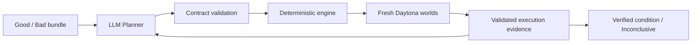

# EnvBisect 실행·개발 가이드

이 문서는 설치·운영·개발 확인용입니다. 제품 소개는 [루트 README](../README.md)를 참고하세요. 아래 명령은 clone한 저장소 루트에서 실행합니다.

### Find the condition that makes your software fail.

**AI의 가설을 실행 가능한 실험으로 바꾸고, 검증된 실패 조건을 돌려주는 디버깅 데모.**

런타임 업데이트 뒤 CI가 실패하면 “버전 문제 같다”는 설명만으로는 부족합니다. 이전 환경을 만들고, 조건을 바꾸고, 테스트를 다시 실행해야 합니다. EnvBisect는 이 반복을 하나의 evidence-driven experiment loop로 제공합니다.

> The LLM chooses the experiment. Daytona creates the worlds. Execution decides what's true.

## 현재 구현

- GitHub 이슈 링크 입력창에 데모 링크가 미리 채워져 있습니다. 현재는 **Node.js #65601 하나만 지원**하며 다른 링크는 실행 전에 차단합니다.
- 준비된 Node.js 사례의 good/bad 조건을 실제 실행해 재현합니다.
- LLM이 이전 world ID와 PASS/FAIL을 근거로 다음 비교를 선택합니다.
- 엔진이 허용된 조건만 실행하고, 숫자 축 탐색과 인접 조건 반복 검증을 담당합니다.
- Daytona에서 실험별 독립 sandbox를 생성·병렬 실행·삭제합니다.
- 로컬 웹에서 실험 시작·안전 중단·기록 조회·증거 다운로드·실패 조건 재실행이 가능합니다.
- 웹의 새 실험은 **Daytona + LLM으로 고정**되어 있습니다. Local/RULES 선택 메뉴는 없고 웹 API에서도 해당 실행을 거부합니다.
- 검정·차콜 + 라임 그린 테마와 6장면 발표 모드를 제공합니다. 실제 증거에 기반한 비교·다음 결정과 sandbox lifecycle을 표시합니다.
- CLI와 웹은 같은 엔진을 사용합니다. 계정 연결 UI나 채팅 UI는 없습니다.

**링크를 입력한다고 GitHub 내용을 자동 분석하는 것은 아닙니다.** 지원하는 이슈를 `bundle.json`과 준비된 재현 테스트에 연결합니다. 임의 저장소·PR·CI 실패 가져오기, SciPy Demo B, snapshot 가속, 자동 patch/PR 생성은 아직 구현하지 않았습니다.



CI도 dynamic matrix를 만들 수 있고 coding agent도 실험할 수 있습니다. 차이는 독점적인 기능이 아니라 **증거 기반 실험 선택·통제된 조건 변경·실행·재검증·중단 기준을 제품의 기본 흐름으로 묶는 것**입니다. Daytona는 이를 API로 연결하는 구현 부담을 낮추며, 다른 인프라로도 구축할 수 있습니다.

## Quick start — Windows CMD

Python 3.11 이상, Git, Daytona/OpenAI API 키가 필요합니다.

```cmd
git clone https://github.com/jisu8110/envbisect.git
cd envbisect
python -m venv .venv
.venv\Scripts\python -m pip install -r requirements.txt
copy .env.example .env
```

`.env`에 본인의 키를 입력합니다. 따옴표로 감싸도 됩니다. 기존 프로세스 환경변수 값이 있으면 그 값이 우선합니다.

```dotenv
DAYTONA_API_KEY="your-daytona-api-key"
OPENAI_API_KEY="your-openai-api-key"
OPENAI_MODEL="gpt-5.5"
```

```cmd
.venv\Scripts\python web.py
```

브라우저 주소창에 `http://127.0.0.1:8000`을 입력합니다. 터미널은 열어 두세요. **웹 서버를 켜는 것만으로 과금되는 실험이 시작되지는 않습니다.** 기본으로 채워진 데모 이슈 링크를 확인하고 Enter 또는 `실험 시작`을 누르면 실제 Daytona + LLM 실험을 시작합니다.

PowerShell의 설정 파일 복사는 `Copy-Item .env.example .env`입니다. macOS/Linux에서는 `python3 -m venv .venv`, `.venv/bin/python -m pip install -r requirements.txt`, `cp .env.example .env`, `.venv/bin/python web.py`를 사용합니다. 로컬 웹의 실사용 검증 환경은 Windows입니다.

### 이슈 입력과 실행 기록

1. `https://github.com/nodejs/node/issues/65601`이 입력창의 기본값입니다. 앞뒤 공백과 마지막 슬래시는 허용합니다.
2. 다른 링크를 제출하면 **“아직 지원하지 않는 링크입니다”** 안내와 **데모 링크로 되돌리기** 버튼이 나타납니다. 이때 유료 실행이나 외부 링크 요청은 하지 않습니다.
3. 실행 중에는 실제 실험 결과가 갱신됩니다. 완료 결과는 `실행 기록`에서 다시 열 수 있습니다.
4. 기록 조회는 `RECORDED`이며 새 실행이 아닙니다. 예전 Local/RULES 기록이 있더라도 출처를 바꾸어 표시하지 않습니다. 새 clone에는 실행 로그가 없으므로 기록 목록은 비어 있습니다.
5. `실패 world 다시 실행`은 Daytona 기록의 조건 하나만 재실행합니다. 새로운 실험을 선택하지 않으므로 **LLM 호출 없는 수동 재현**으로 표시합니다. Local 기록은 조회·다운로드만 가능합니다.

### 발표 모드

실행 기록을 선택하고 상단 `발표 모드`를 누릅니다. 이전/다음 버튼 또는 좌우 방향키로 이동하고, `워크스페이스로 돌아가기`로 나옵니다.

```text
Incident → Baseline → Controlled Experiment
        → Next Decision → Verified Boundary → Evidence Package
```

- 설정과 전체 world 목록을 접고 핵심 비교만 보여줍니다.
- `Only size changed` 같은 문장은 실제로 다른 입력 조건이 같을 때만 표시합니다.
- Next Decision은 **그 결정 전에 존재했고 planner가 인용한 관찰**을 사용합니다. 이후 탐색 결과를 과거의 근거로 소급하지 않습니다.
- Daytona 카드에는 생성·실행·증거 수집·삭제 이력, 짧은 sandbox ID와 cleanup 상태를 표시합니다. Local 실행은 별도로 표시합니다.
- 검증된 경계가 없으면 성공 장면을 만들지 않고 해당 상태를 표시합니다.

발표 모드는 기록 표시 방식만 바꾸며 자동 재실행하지 않습니다. 별도의 Demo Run 열기·고정 버튼은 없습니다.

### 수정 반영과 안전 중단

| 상황 | 방법 |
|---|---|
| 진행 상황 | 약 1.2초마다 자동 갱신 |
| HTML/CSS/JS 수정 | 브라우저 `Ctrl+F5` |
| Python 또는 `.env` 수정 | 터미널 `Ctrl+C` → 정리·종료 대기 → 서버 재실행 |
| 실험만 중단 | 화면의 `안전하게 중단` |
| 서버까지 종료 | 터미널 `Ctrl+C`, 종료 안내까지 대기 |

새로고침은 실험을 중복 시작하지 않습니다. 탭 닫기는 실험 중단이 아닙니다. 서버 하나는 한 번에 한 실험만 실행합니다. 별도 CLI/서버 프로세스까지 잠그지는 않으므로 동시에 여러 서버를 돌리지 마세요.

다른 포트는 `web.py --port 8001`입니다. 서버는 loopback에만 바인딩하며 `.env`나 소스 디렉터리 전체를 웹에 노출하지 않습니다.

## CLI — 개발·검증용

웹은 Daytona + LLM 전용입니다. 아래 Local/RULES 옵션은 개발·회귀 확인을 위한 **CLI에만** 남아 있습니다.

아래의 `python`은 가상환경의 실행 파일을 뜻합니다. Windows CMD에서는 `.venv\Scripts\python`으로 실행하세요.

```sh
python demo.py                         # Daytona + 실제 LLM
python demo.py --smoke                 # baseline 2개, LLM 호출 없음
python demo.py --planner rules         # Daytona + 규칙 기반 선택, AI 아님
python demo.py --max-worlds 60 --seconds 600
python -m unittest discover -s tests -v  # 유료 호출 없는 자동 테스트
node tests/test_presentation.js          # Node 설치 시, 발표 증거 표시 로직 테스트
```

기본 예산은 **80 worlds / 동시 4개 / planner 최대 6회 / 900초 soft budget**입니다. 실행 중인 HTTP 요청과 정리는 예산 종료 뒤에도 완료를 기다릴 수 있습니다. 자동 재시도나 규칙 모드로의 조용한 전환은 없습니다.

로컬 실행을 쓰려면 버전별 바이너리를 직접 준비합니다.

```text
node-versions/
├── 26.7.0/node.exe
└── 26.8.1/node.exe
```

Windows 외에는 실행 파일 이름이 `node`입니다. `python demo.py --backend local --planner rules --node-dir "path/to/node-versions"`는 유료 API 호출 없이 고정 fixture를 실행합니다. CLI에서 `--planner openai`로 바꾸면 LLM 호출 비용이 발생합니다. **로컬 프로세스 실행은 보안 sandbox가 아닙니다.** 웹 서버의 `--node-dir` 옵션은 제거했습니다.

실행 중인 웹 서버에 대해 `python tests/http_smoke.py`를 실행하면 유료 실행 없이 요청 보안·지원 링크·모드 제한을 검사합니다. `--live`를 추가하면 실제 Daytona 자원을 생성하는 취소 검사가 되므로 과금에 유의하세요.

## 데모의 의미

[Node.js #65601](https://github.com/nodejs/node/issues/65601)의 작은 재현 프로그램을 사용합니다. 기대 결과는 바이트 버퍼를 typed-array view로 만드는 작업이 예외 없이 완료되는 것입니다. 동일한 8-byte 입력에서 Node 26.7.0은 PASS, 26.8.1은 FAIL인지 새로 측정합니다.

모델이 비교할 조건을 고르고, 관찰에 따라 다음 실험이 달라집니다. 탐색 엔진은 모델이 선택한 숫자 축의 FAIL/PASS 조건을 좁혀 각각 5번의 새 실행으로 검증합니다. 알려진 경계값을 planner 입력이나 탐색 정답으로 넣지 않습니다.

검증 기록에서 관찰된 `32,767 FAIL → 32,768 PASS`는 **Node 26.8.1 / pooled / implicit / Uint32** 조건의 국소 전환입니다. Node 26.8.x 전체, 전역 단조성, 완전한 root cause 또는 앱 전체 수정 완료에 대한 주장이 아닙니다. 모델의 선택이나 관찰에 따라 `INCONCLUSIVE`로 끝날 수 있습니다.

## 검증 현황

| 경로 | 확인 결과 |
|---|---|
| Python 자동 테스트 | 36개 통과 |
| 발표 표시 로직 / 브라우저 | JavaScript 테스트 통과; 다크 테마·장면 이동·링크 입력/차단/복원 확인 |
| 실제 OpenAI + 로컬 Node | 55 worlds, LLM 6회, 경계 반복 검증과 LLM STOP 완료 |
| 규칙 기반 + Daytona | 53 worlds, 경계 검증 완료, 53개 삭제 |
| 실제 OpenAI + Daytona | 12 worlds, 비단조 관찰로 INCONCLUSIVE, 12개 삭제 |
| 짧은 실제 OpenAI + Daytona 확인 | 6 worlds, LLM 1회, 32.253초, 한 라운드 예산 종료로 INCONCLUSIVE, 6개 삭제 |
| 웹 취소 + Daytona | 생성된 2개 모두 삭제, CANCELLED |

실제 LLM + Daytona 경계 확정 성공으로 위 경로들을 합쳐 말하면 안 됩니다. 짧은 검증은 연결 확인이지 전체 성공 검증이 아닙니다. 시간은 단일 실행 관찰이며 성능 보장이 아닙니다. 세부 기록은 [VERIFICATION.md](../VERIFICATION.md)에 있습니다. 원시 실행 로그는 로컬에 보관하며 이 저장소에는 포함하지 않았습니다.

## 안전과 증거

- 모델은 임의 shell을 생성하지 않고 허용된 factor 값만 선택합니다. 엔진이 실제 버전·입력·종료 코드·JSON 결과·정리 상태를 검증합니다.
- 인프라 오류, 잘못된 action, 예산 초과, 결과 뒤집힘, 관측된 비단조성은 확정 결과로 포장하지 않습니다.
- Daytona 생성 시 15분 wall-clock TTL, idle auto-stop 5분, 중지 시 auto-delete를 요청합니다. TTL 응답을 확인한 뒤에만 실행하며 정상·취소 경로 모두 즉시 삭제를 시도합니다.
- 강제 종료, 생성 응답 유실, 삭제 실패, 서비스 장애 시에는 Daytona 대시보드 확인이 필요합니다. TTL은 보조 안전장치입니다.
- `.env`, 가상환경, `runs/`는 Git에서 제외합니다. API 키를 issue·스크린샷·공유 파일에 포함하지 마세요.
- `runs/<run-id>/events.jsonl`과 `summary.json`에 증거를 보관합니다. 다운로드 파일은 공유 전에 다시 확인하세요.

## 코드와 문서

| 위치 | 역할 |
|---|---|
| `web.py`, `web/` | 로컬 실험 workspace와 API |
| `demo.py`, `engine.py` | CLI·공유 실행 흐름·예산·탐색·검증 |
| `planner.py`, `contracts.py` | LLM 선택과 엄격한 실험 계약 |
| `executor.py`, `managed_runner.py` | 실제 실행·lifecycle·취소·TTL·정리 |
| `fixtures/repro.js`, `node_prep.py` | 재현 oracle과 버전 고정 런타임 준비 |
| `history.py` | 저장된 증거와 단일 world 재현 |
| `tests/` | mock·합성 oracle 기반 회귀 테스트, 선택적 HTTP smoke |
| [문서 목록](README.md) | OnePager·Handoff·Pitch·UI 기획·사전 근거 |

`daytona_runner.py`는 기존 검증본 보존용이며 현재 기본 원격 실행은 `managed_runner.py`를 사용합니다. 기획 문서의 미래 계획·사전 실험과 현재 구현은 구분해서 읽어 주세요.
